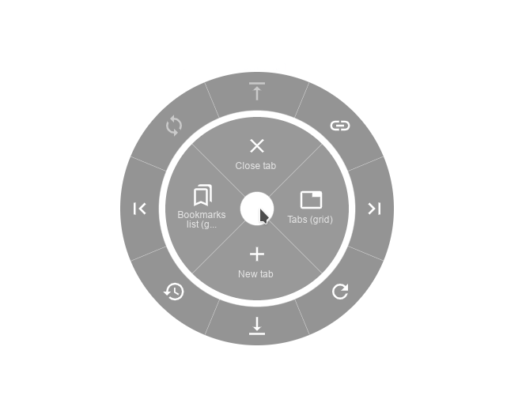

#  Circle Mouse Gestures

This extension introduces convenient circle menu (so-called pie menu) to improve interaction with your browser. 
Just hold down the right mouse button, highlight one of the actions and release the button. 

Circle menu recreates the way mouse gestures were represented in good old Opera 12 browser, and allows to clearly see all available gestures, with no need to remember them all.
CMG is supposed to provide a better implementation of mouse gestures and drag gestures, while replacing the regular context menu at the same time — but regular context menu is always there whenever you need it. Perfect for fullscreen browsing!

Extension features:
- Regular actions, such as 'Go back', 'New tab', 'Scroll to top' etc.
- Separate gestures for links, images, input fields etc.
- Support for rocker gestures and mouse wheel gestures
- Supports horizontal wheel gestures - great on mouses with horizontal wheel, such as MX Master
- Support for trigger on long left click
- Great customization options - add actions levels, set their width and color for each action

Additional tools:
- Link preview (like in Safari on mac)
- Tab switcher (vertical/horizontal/grid), with ability to quickly switch, search and close tabs
- Bookmarks viewer (list/grid), with ability to search and open bookmarks
- Image viewer, with ability to view given image in fullscreen, zoom it and rotate 

Get for Firefox  

Get for Chrome (Edge, Brave, Vivaldi etc)   

## FAQ
Moved to the Wiki page – [read here](https://github.com/emvaized/circle-mouse-gestures/wiki/FAQ-(Frequently-Asked-Questions))

## Donate
If you really enjoy this project, please consider supporting its further development by making a small donation using one of the ways below! 

 &nbsp;  &nbsp; 

## Building
- `npm install` to install all dependencies
- `npm run build` to generate `dist` folder with minimized code of the extension

## Some ideas for future releases or contributions
- [x] Import/export settings
- [x] Option to set custom favicon for 'Open URL' action
- [x] Action to execute custom Javascript
- [ ] Actions to switch to first/last tab
- [ ] Option to require modifier key to show circle menu (and override context menu) 
- [ ] Add `npm run build` parameter to build specific Firefox/Chromium versions (with changes to `manifest.json`)
- [ ] Fix broken mouse detection on Vivaldi browser (specifically, conflicts with built-in gesture systems)

## My other browser extensions and projects
*  [Selecton](https://github.com/emvaized/selecton-extension) – smart text selection popup 
*  [Open in Popup Window](https://github.com/emvaized/open-in-popup-window-extension) – quickly open any links and images in a small popup window with no browser controls
*  [Text reflow on zoom](https://github.com/emvaized/text-reflow-on-zoom-mobile) – userscript and mobile browser extension which reflows all text after a pinch gesture
*  [Modern Inverted Mouse Cursors](https://www.patreon.com/emvaized/shop/modern-inverted-mouse-cursors-for-10-11-924356) – cursor pack for Windows 10/11 which inverts all colors behind cursors 